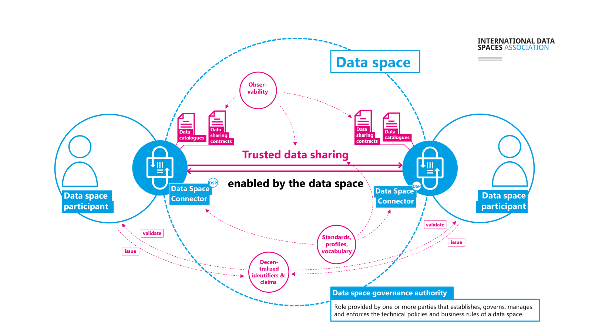
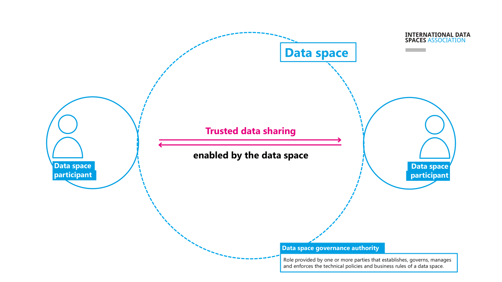
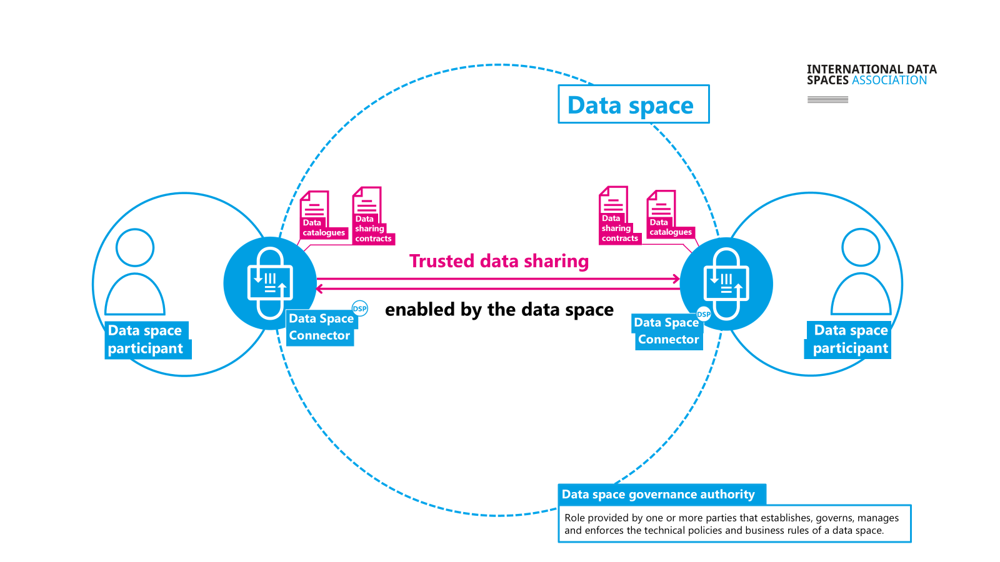
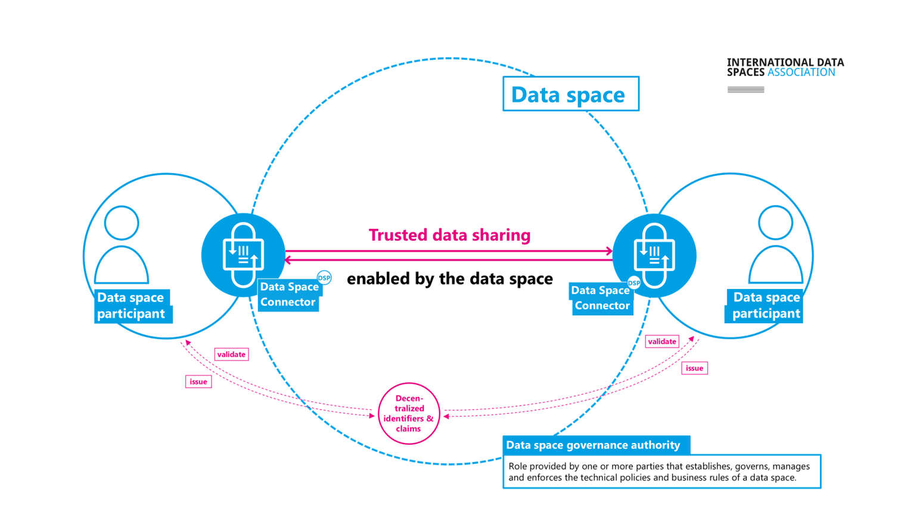
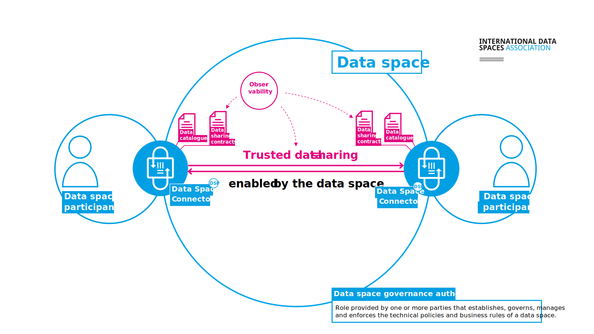
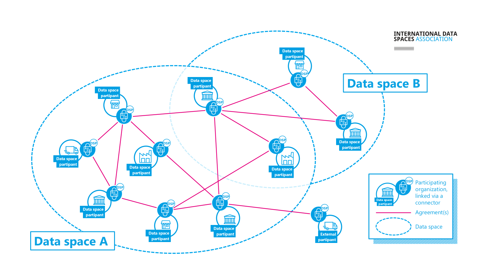

# Introduction to data spaces

This document gives an overview of the main technical concepts in data
spaces that have been evolving over the past few years.

These concepts are reflected in the upcoming new versions of IDSA
Rulebook (v3.0), which defines the foundational concepts, rules and
requirements for data spaces and IDS-RAM (v2026-1) providing
architectural guidance for data spaces.

## Data spaces

**Data spaces enable trusted data sharing, thus creating added value.**

The ISO/IEC 20151 Standard "Information technology - Cloud computing
and distributed platforms - Dataspace concepts and characteristics"
defines data spaces as

**environment enabling trusted data sharing between participating parties, based on an agreed governance framework, along with an agreed set of policies, semantic models, standardised protocols, processes, and facilitating services.**

The next sections provide details on some of these elements, please also
refer to the IDSA Rulebook 3.0, [What is a Data
space](https://github.com/International-Data-Spaces-Association/IDSA-Rulebook/blob/Rulebook-3.0/003_WhatIsADataspace.md)
section for more information.

## Key roles

**Data Space participants** are organizations or entities that want to
share data. They take part in a governed data-sharing environment by
providing or consuming data or even both.

They follow common rules defined in the data space's governance
framework. Their goal is to generate value out of the data.

Participants can act in different roles (data provider, data
consumer, data holder, etc. ) depending on which facet you are looking
at a data space from (technical, economic, legal, etc.). See
[layers](https://github.com/International-Data-Spaces-Association/IDSA-Rulebook/blob/Rulebook-3.0/004_Layers.md)
and
[roles](https://github.com/International-Data-Spaces-Association/IDSA-Rulebook/blob/Rulebook-3.0/005_Roles.md)
pages in the IDSA Rulebook for more details.

The **Data Space Governance Authority** **(DSGA)** provides the overall
framework for trusted data sharing. This is a role that may be provided
by one or more parties, in a centralized or decentralized manner. It
establishes, governs, manages and enforces the technical policies and
business rules of a data space.

The governance framework may be very simple, or quite complex depending
on the needs of the data space and the use cases. See [DSGA
page](https://github.com/International-Data-Spaces-Association/IDSA-Rulebook/blob/Rulebook-3.0/006_DSGA.md)
in the Rulebook for more details.

## Data Space Connectors and the Dataspace Protocol

**Each participant is represented by a software agent (Data space connector) which acts on behalf of this organization in the data space.**

The **Dataspace Connector** offers API endpoints for data and service
discovery, data sharing contract negotiation, data sharing orchestration
and management of claims about the organization.

**IDS-RAM** describes these capabilities which can be realized using specifications such as the **Dataspace protocol** to ensure interoperable communications.

The **Dataspace Protocol** (ISO/IEC DIS 26450) defines
publication/discovery, agreement negotiation, and data access
interactions for interoperable data sharing. [^1]

## Decentralized identifiers & claims

This approach supports multiple trust anchors, preserves privacy, and
gives participants full technical control over presenting and verifying
identity claims.

**Decentralized Claims Protocol**, DCP (ISO/IEC DIS 26451) provides an
overlay to the Dataspace protocol for organizational identity and
trust/credential verification while preserving privacy. [^2]

For more information, please visit the draft [IDSA position paper on
Identifiers in Data
Spaces](https://github.com/International-Data-Spaces-Association/identity-in-data-spaces).

## Observability

**Data sharing transactions can be monitored for legal or business purposes through observability.**

This is the key capability that observes data sharing transactions to
ensure compliance with data sharing contracts. The requirements for
**observability** derive from the actual business processes, from the
agreements between data space participants, and from the general data
space governance rules.

For more details, please refer to the [IDSA Position Paper Observability
in data
spaces](https://internationaldataspaces.org/download/51606/?tmstv=1773925364).

## Standards, profiles and vocabulary

***Additional elements help enable interoperability in data spaces.***

Given the diversity of participants in data spaces, data must be
annotated with shared **vocabularies**, formalized through **open
standards** and customized via community-specific **profiles** tailored
to domains or use cases.

## Data sharing across data spaces

**Trusted data sharing between participants in different data spaces is also possible, through measures for interoperability and decentralization.**

[^1]: <https://eclipse-dataspace-protocol-base.github.io/DataspaceProtocol/>

[^2]: <https://eclipse-dataspace-dcp.github.io/decentralized-claims-protocol/>
